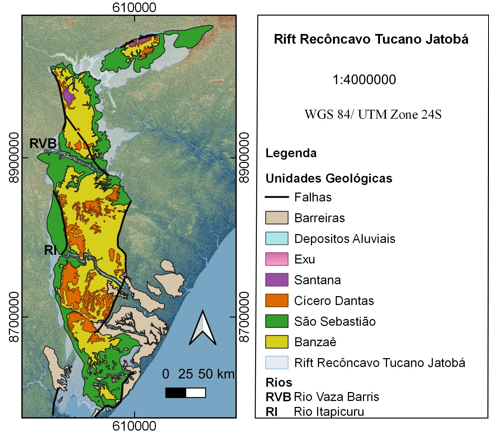

# Mapa Geológico Recôncavo Tucano Jatobá.

Este Mapa foi criado no QGIS, versão 3.4., por Janaína Gerdulino, usando dados de Bernardo Tavares de Freitas disponíveis em: 

## Linguagens disponíveis

Estas instruções de uso estão disponíveis nas seguintes linguagens:

- [Português](README-pt_BR.md)

## Alterações

Caso queira fazer alterações nas camadas usando um Sistema de Informações Geográgicas (SIG) siga as instruções:

- Dentro da Pasta "Tucano Basin" baixe a pasta "Mapa_Geologico_Bacia_Tucano_Jatoba.zip" através [deste link no google drive](https://drive.google.com/drive/folders/1TCvxn5FR1GQgPihrCxRs_5TP24SDcay4?usp=sharing)
- Extraia a pasta compactada e a salve em "Documentos" (evite renomea-lá).
- Para abrir o mapa no QGIS clique em "Bacia Completa".
- Se quer abrir em outro SIG ou em caso do passo anterior não funcionar: Importe todos os arquivos da pasta para a Área de Trabalho do SIG em questão.

## Tipos de arquivos  e suas funções

O mapa geológico da Bacia do Tucano Jatobá é constituído pelos seguintes arquivos:

- 5 arquivos em raster: Relevo e 4 Sombras (45°;135°;225°;315°) // servem para dar ideia de prefundidade e observar as mudanças de altitude.
- 8 arquivos shapefile (em poligonos): Bacia Tucano Jatoba; São Sebastião; Banzae; Cicero Dantas; Santana; Exu; Depositos Aluviais; Barreiras.// Além da própria bacia, são respectivamente as formações geológicas por ordem da mais antiga para a mais jovem.
- 2 arquivos shapefile (em linhas): falhas e falhas_trac // Foram separadas pela facilidade em desenha-las, pois ambas se tratam de dobras e falhas entre as formações.
- 1 arquivo shapefile (em linha) opcional: A hidrologia da bacia está na pasta, mas não está no projeto "Bacia Completa" caso deseje adiciona-la ao mapa importe o arquivo.
- 1 arquivo em png do mapa geológico em alta resolução
